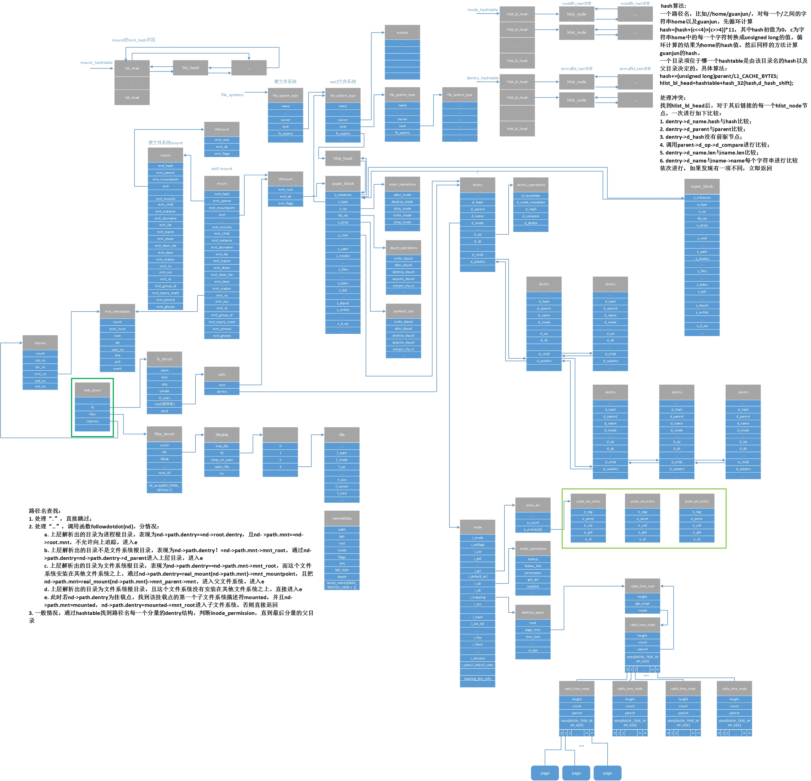

# FileSystem-从系统调用角度看文件系统
 文件系统到底是什么？不妨看看文件系统在内核中的组织形式，参见文件系统.jpg，如下图
 
 
1	open系统调用
1.1	入口
SYSCALL_DEFINE3(open, const char __user *, filename, int, flags, umode_t, mode)
	open系统调用标识；
	filename用户空间的路径名地址；
	flags标志位，比如打开方式、文件不存在时是否创建等；
	mode文件不存在需要创建文件的权限位。
1.2	主要功能实现
	调用force_o_largefile()判断是否支持大文件；
	调用build_open_flags设置不同的flags标志位，mode权限位，并整合成open_flags对象；
	调用getname分配一页内存，并根据用户态路径地址filename将路径名拷贝进内核；
	调用get_unused_fd_flags获得当前进程的可以使用的文件描述符fd；
	调用do_filp_open开始根据路径名查找到路径名的最后一个分量的父目录parent，根据父目录parent以及路径名最后一个分量通过目录项缓存找到最后一个分量的dentry。如果dentry是有效的，调用atomic_open打开文件；如果dentry是无效的，根据flags标识决定是否需要调用vfs_create创建文件。返回文件对象file；
	调用fsnotify_open通知父目录该文件已经打开；
	调用fd_install将当前进程的打开文件信息fd与file文件对象绑定；
	调用putname释放getname分配的内存；
	返回文件描述符fd。

2	close系统调用
2.1	入口
SYSCALL_DEFINE1(close, unsigned int, fd)
	fd需要关闭的文件的文件描述符
2.2	主要功能实现
	调用__close_fd将当前进程的fdtable的open_fds的fd位清0、将next_fd设置为fd。调用flush将文件内容写进磁盘。释放file文件对象上的锁

3	read系统调用
3.1	入口
SYSCALL_DEFINE3(read, unsigned int, fd, char __user *, buf, size_t, count)
	read系统调用标识
	fd文件描述符
	buf用户空间的缓冲区地址
	count一次读取的字节数
3.2	主要功能实现
	调用fdget将fd和根据fd获得的文件对象file绑定在fd结构体上，并将file文件对象的f_count加一；
	调用file_pos_read通过文件对象file获取当前文件的读取位置pos；
	调用rw_verify_area将file加锁，以及读权限检查；
	调用具体文件系统的read函数开始读取，并将读取内容放在buf上
	调用file_pos_write将文件对象的文件读取位置进行更新；
	调用fdput将文件对象的f_count减一
	返回读取成功的字节数

4	write系统调用
4.1	入口
SYSCALL_DEFINE3(write, unsigned int, fd, const char __user *, buf, size_t, count)
	write系统调用标识；
	fd文件描述符
	buf用户态的缓冲区地址；
	count一次读取的字节数。
4.2	主要功能实现
	调用fdget将fd和根据fd获得的文件对象file绑定在fd结构体上，并将file文件对象的f_count加一；
	调用file_pos_read通过文件对象file获取当前文件的写位置pos；
	调用rw_verify_area将file加锁，以及写权限检查；
	调用具体文件系统的write函数开始写，返回写成功的字节数
	调用file_pos_write将文件对象的位置进行更新；
	调用fdput将文件对象的f_count减一
	返回写成功的字节数。
4.3	详细实现过程
4.3.1	 fdget(fd)
函数原型： static inline struct fd fdget(unsigned int fd)
参数： 文件描述符fd
数据对象： 
	current->files->count
	current->files->fdt->fd[fd]
	current->files->fdt->fd[fd]->f_mode
	current->files->fdt->fd[fd]->f_count
功能： 通过fd获得文件对象file
数据对象变化： 
	如果current->files->count == 1
fd.file = current->files->fdt->fd[fd];
fd.need_put = 0
return fd;
	如果current->files->count != 1 && (current->files->fdt->fd[fd]->f_mode & FMODE_PATH == 0)
fd.file = current->files->fdt->fd[fd];
fd.need_put = 1
return fd;
	如果current->files->count != 1 && (current->files->fdt->fd[fd]->f_mode & FMODE_PATH == 1)
fd.file = NULL;
fd.need_put = 0;
return fd;
4.3.2	 file_pos_read(f.file)
函数原型：static inline loff_t file_pos_read(struct file *file)
参数： 文件对象file
数据对象： 
	file
功能： 通过文件对象获取文件位置
数据对象变化： 
	return file->f_pos;
4.3.3	 vfs_write(f.file, buf, count, &pos)
函数原型： ssize_t vfs_write(struct file *file, const char __user *buf, size_t count, loff_t *pos)
参数： 文件对象file，用户态缓冲区地址buf，写入字节数count，写入位置pos
数据对象： 
	file
	superblock
	file->f_inode
	file_lock
	current->files
	current->tgid
	blocked_hash
	current
	__wait_queue_head
功能： 将用户态缓冲区buf的内容写入文件
数据对象变化： 
	如果file->f_mode & FMODE_WRITE == 0
return –EBADF;
	如果!file->f_op->write && !file->f_op->aio_write，即文件系统未定义写函数
return -EINVAL;
	调用ret = rw_verify_area(WRITE, file, pos, count)：判断是否有冲突的锁；调用LSM模块的file_permission(file, mask)进行权限检查
	如果ret >=0
调用file_start_write(file)；
ret = do_sync_write(file, buf, count, pos)；
	如果ret > 0
fsnotify_modify(file);
add_wchar(current, ret);
		inc_syscw(current);
		file_end_write(file);
		return ret
	如果ret < 0
return ret;
 
4.3.3.1	rw_verify_area(WRITE, file, pos, count)
函数原型： int rw_verify_area(int read_write, struct file *file, const loff_t *ppos, size_t count)
参数： 文件对象file，写入文件位置ppos，写入字节数count
数据对象： 文件对象file，当前的进程current
	file
	inode
	inode->i_flock
	current
	file_lock
	current->files
	current->tgid
	__wait_queue_head
功能： 判断是否有冲突的写锁，LSM模块进行安全检查
数据对象的变化：
	inode = file->f_inode; retval = -EINVAL;
	如果count < 0，即写入字节小于0
return retval;
	如果count >= 0 && *ppos < 0，即写入文件位置小于0
	如果file->f_mode & FMODE_UNSIGNED_OFFSET == 0，即文件系统未采用无符号偏移量
return retval;
	如果count >= -pos && file->f_mode & FMODE_UNSIGNED_OFFSET != 0
return -EOVERFLOW;
	如果count >= 0 && *ppos >= 0
	如果(*ppos + count) < 0，写入完成之后超过无符号长整形能表示的最大数
	如果file->f_mode & FMODE_UNSIGNED_OFFSET == 0
return retval;
	如果(*ppos + count) >= 0 && inode->i_flock && ((inode)->i_sb->s_flags & (MS_MANDLOCK))，即写入位置以及字节无误且文件支持加强制锁
调用retval = locks_mandatory_area(read_write == READ ? FLOCK_VERIFY_READ : FLOCK_VERIFY_WRITE,inode, file, pos, count);
	如果retval < 0
return retval;
retval = security_file_permission(file,read_write == READ ? MAY_READ : MAY_WRITE);
	如果retval != 0
return retval;
return count > MAX_RW_COUNT ? MAX_RW_COUNT : count;

4.3.3.1.1	locks_mandatory_area(read_write == READ ? FLOCK_VERIFY_READ : FLOCK_VERIFY_WRITE, inode, file, pos, count)
函数原型： int locks_mandatory_area(int read_write, struct inode *inode, struct file *filp, loff_t offset, size_t count)
参数： 读写标识read_write，文件inode，文件对象file，文件位置offset，判断的字节数
数据对象： 文件索引节点inode，文件对象file，当前进程current
	inode
	file_lock
	current->files
	current->tgid
	file
	current
	__wait_queue_head
功能： 判断是否有冲突的锁
数据对象的变化：
	分配一把file_lock类型的文件锁fl，并初始化。
	进入循环：
	调用error = __posix_lock_file(inode, &fl, NULL)判断该inode节点上是否有和fl锁冲突的锁；
	如果error != FILE_LOCK_DEFERRED，即上一个函数返回值显示文件没有死锁
return error
	如果error == FILE_LOCK_DEFERRED，即出现死锁
调用error = wait_event_interruptible(fl.fl_wait, !fl.fl_next)，该锁指向的等待队列等待!fl.fl_next事件或者有信号需要处理。
	error == 0，即!fl.fl_next事件发生或接收到信号，进程被唤醒
	如果(ino->i_mode & (S_ISGID | S_IXGRP)) == S_ISGID，即判断文件的权限可以设置组ID并且没有组执行权限
continue，继续循环加锁
	error != 0 && (ino->i_mode & (S_ISGID | S_IXGRP)) ！= S_ISGID
删除文件锁fl;
break退出循环
	return error
4.3.3.1.1.1	__posix_lock_file(inode, &fl, NULL)
函数原型： static int __posix_lock_file(struct inode *inode, struct file_lock *request, struct file_lock *conflock)
参数： 文件inode节点，文件锁结构file_lock，复制一把锁conflock（写过程中为nulll）
数据对象： 
	inode
	file_lock
	blocked_hash
功能： 在读写过程中只需要找到是否有冲突的锁，如果有冲突返回错误码，返回0
数据对象的变化：
	error = 0
	如果request->fl_type != F_UNLCK，F_UNLCK表示不加锁，该条件下fl表示inode上已经存在的锁，request表示申请的锁
从inode->i_flock指向的锁链表的起始节点开始遍历整个链表，分别做如下检查：
	fl->fl_flags & FL_POSIX == 0
continue遍历下一个节点
	分别做如下判断：fl->fl_flags & FL_POSIX ！=0 并且（request->fl_flags & FL_POSIX || request->fl_owner == fl->fl_owner），即都是POSIX锁且他们的owner相同，则没有冲突；两把锁的范围没有交集，则没有冲突；两把锁有交集但是两把锁都不是写锁，则没有冲突
没有冲突则continue遍历下一个节点
	如果有冲突
调用posix_locks_deadlock(request, fl)进行死锁检测，该函数返回0或者1：
	当返回值为0，表示有死锁
error = FILE_LOCK_DEFERRED
调用__locks_insert_block(fl, request)
	如果返回值为1，表示没有死锁，但是有可能发生死锁
error = -EDEADLK
return error
	返回error。写过程只会判断到这里，函数接下来的锁调整不会去执行。
4.3.3.1.1.2	wait_event_interruptible(fl.fl_wait, !fl.fl_next)
说明： 当上一函数返回结果并非FILE_LOCK_DEFERRED（具有死锁），进入该宏
函数原型： 该定义为宏定义
参数： 文件锁的阻塞队列fl_wait
数据对象：
	fl_wait
	fl.fl_next
	current
功能： 等待!fl.fl_next ！= 0唤醒进程或者进程接到中断信号
数据对象的变化：
	初始化一个等待队列项__wait，等待队列项用于保存阻塞进程以及唤醒函数；
	进入无限循环；
	调用prepare_to_wait_event，设置等待队列项字段，将进程状态设置为TASK_INTERRUPTIBLE，将等待队列项加入等待队列头指向的等待队列中。返回值__int为0表示将进程成功挂起；返回值为-ERESTARTSYS表示进程需要处理信号，处理完信号重新执行系统调用
	!fl.fl_next != 0，即冲突锁解除，满足进程唤醒条件，退出循环
	!fl.fl_next == 0，调用schedule()进行进程调度
	调用finish_wait(&wq, &__wait)，设置进程状态TASK_RUNNING，将等待队列项从等待队列中移除
4.3.3.1.1.3	locks_delete_block(&fl)
函数原型：static void locks_delete_block(struct file_lock *waiter)
参数：文件锁结构file_lock类型对象waiter
数据对象：
	文件锁file_lock
功能：删除一把锁
数据对象变化：
	对blocked_lock_lock加自旋锁；
	将waiter->fl_link从全局锁链表（通过hlist_node结构链接）中删除；
	将waiter->fl_block从所有等待该锁的锁链表（通过list_head）中删除；
	将waiter->next = NULL，表示从该文件索引节点i_flock指向的单链表中删除；
	对blocked_lock_lock解自旋锁。
4.3.3.1.2	security_file_permission(file,read_write == READ ? MAY_READ : MAY_WRITE)
4.3.3.2	file_start_write(file)
函数原型：static inline void file_start_write(struct file *file)
参数：文件对象file
数据对象：
	file
	superblock
	percpu_counter
功能：判断文件系统等级（未冻结、冻结写、冻结页缺失、冻结、完全冻结），并将写者加一，该等级与文件系统快照有关，具体作用不详
数据对象变化：

4.3.3.2.1	__sb_start_write(file_inode(file)->i_sb, SB_FREEZE_WRITE, true)
4.3.3.3	do_sync_write(file, buf, count, pos)
函数原型： ssize_t do_sync_write(struct file *filp, const char __user *buf, size_t len, loff_t *ppos)
参数： 写入的字节数len，文件写入位置ppos
数据对象： 
	file
	current
	super_block
功能： 写文件具体函数
数据对象变化：
	将用户空间缓存地址buf与写入字节数len封装在iovec类型的对象iov里面
	根据文件对象file以及当前的进程初始化一个kiocb类型的对象kiocb，其中ki_ctx = NULL，ki_filp = filp，ki_obj.tsk = current，ki_pos = *ppos，ki_nbytes = len
 
	调用aio_write(&kiocb, &iov, 1, kiocb.ki_pos)进行异步写，在EXT4文件系统中调用static ssize_t ext4_file_write(struct kiocb *iocb, const struct iovec *iov, unsigned long nr_segs, loff_t pos)：通过iocb->ki_filp获得文件的inode节点；2. 判断inode是否有EXT4_INODE_EXTENTS标识，如果不含有该标志，即ext4_inode_info.i_flags & EXT4_INODE_EXTENTS == 0，则EXT4采用传统的块映射方式存储文件，此时文件大小受到超级块的s_bitmap_maxbytes大小限制，进行参数调整；3. 判断文件对象file的f_flags是否有O_DIRECT标识，如有调用ext4_file_dio_write(iocb, iov, nr_segs, pos)，否则调用generic_file_aio_write(iocb, iov, nr_segs, pos)，这两个函数分别分析
4.3.3.3.1	init_sync_kiocb(&kiocb, filp)
函数原型： static inline void init_sync_kiocb(struct kiocb *kiocb, struct file *filp)
参数： 内核IO控制块kiocb结构，文件对象file
数据对象： 当前进程current，文件对象file
功能：初始化内核IO控制块kiocb
数据对象的变化：
	kiocb.ki_ctx = NULL
	kiocb.ki_filp = filp
	kiocb.ki_obj.tsk = current
4.3.3.3.2	aio_write(&kiocb, &iov, 1, kiocb.ki_pos)
函数原型：static ssize_t ext4_file_write(struct kiocb *iocb, const struct iovec *iov, unsigned long nr_segs, loff_t pos)
参数： 内核io控制块，封装了用户态缓冲区的iovec结构，nr_segs = 1，写入文件位置
数据对象：
	inode
	file
	ext4_sb_info
	ext4_inode_info
功能： 异步读
数据对象的变化：
	通过iocb获得文件的inode节点，inode = iocb->ki_filp-f_inode；
	如果文件ext4_inode_info.i_flags不具有EXT4_INODE_EXTENTS标识(文件是通过传统的间接映射的方式布局)。此时文件大小受到ext4_sb_info-> s_bitmap_maxbytes限制。通过文件的inode节点获得ext4文件系统超级块（内存），ext4_sb_info = inode->i_sb->s_fs_info；通过ext4_sb_info-> s_bitmap_maxbytes判断文件写入位置是否超过文件最大大小，如果文件写入位置加上文件的写入字节是否超过文件的最大大小，如果是，则调整文件的写入大小
	如果iocb->ki_filp->flags & O_DIRECT != 0，调用ret = ext4_file_dio_write(iocb, iov, nr_segs, pos)进行直接IO操作
	如果iocb->ki_filp->flags & O_DIRECT == 0，调用ret = generic_file_aio_write(iocb, iov, nr_segs, pos);
	返回ret
4.3.3.3.2.1	ext4_file_dio_write(iocb, iov, nr_segs, pos)
函数原型： static ssize_t ext4_file_dio_write(struct kiocb *iocb, const struct iovec *iov, unsigned long nr_segs, loff_t pos)
参数： 内核IO控制块kiocb，封装用户态缓冲的iovec类型结构，要写的段数，写文件的位置pos
数据对象： 
	文件对象file
	文件索引节点inode
	dentry
	super_block
	ext4_sb_info
	current
	wait_queue_head_t
	wait_queue_t
	blk_plug
	ext4_map_blocks
	ext4_es_tree
	extent_status
	rb_node
	ext4_ext_path
	ext4_extent
	ext4_allocation_request
	ext4_io_end_t
	buffer_head
	Indirect
	block_device
	init_user_ns
	ext4_xattr_ibody_header
	ext4_xattr_entry
	ext4_inode
	ext4_iloc
	ext4_xattr_cache
功能： EXT4文件系统DIRECT IO写文件具体函数
数据对象变化：
	如果ext4_inode_info.i_flags & EXT4_INODE_EXTENTS != 0且iocb->ki_ctx == NULL，调用unaligned_aio = ext4_unaligned_aio(inode, iov, nr_segs, pos)判断是否块对齐
	如果unaligned_aio != 0(块未对齐)，DIRECT AIO必须串行方式读取，调用ext4_unwritten_wait(inode)通过inode初始化一个ioend等待队列，将当前进程挂起在该等待队列上，等待事件ext4_inode_info.i_unwritten == 0发生之后唤醒进程
	对inode->i_mutex加锁
	调用blk_start_plug(&plug)，将IO请求存放在current->plug中，方便将很多小的IO请求合并成大的IO请求
	如果ext4_should_dioread_nolock(inode) && !unaligned_aio && !file->f_mapping->nrpages && pos + length <= i_size_read(inode)，即依次做如下判断：
	ext4_sb_info->s_mount_opt & EXT4_MOUNT_DIOREAD_NOLOCK != 0；（检查文件挂载标识）
inode->i_mode & S_IFMT == S_IFREG；（检查是否为普通文件）
ext4_inode_info->i_flags & EXT4_INODE_EXTENTS != 0；（检查是否为extents映射）
ext4的日志模式为JOURNAL模式（分别有JOURNAL模式、ORDERED模式、WRITEBACK模式）；
!unaligned_aio；（块对齐）
!file->f_mapping->nrpages；（块未缓冲）
pos + length <= i_size_read(inode)；（写后未超过文件长度）
	如果上述条件都满足，进行DIO写覆盖：
1.	声明ext4_map_blocks结构的map对象，表示逻辑块与物理块的映射；
2.	map.m_lblk = pos >> blkbits;要写的位置所在的逻辑块号
3.	map.m_len = (EXT4_BLOCK_ALIGN(pos + length, blkbits) >> blkbits)- map.m_lblk;要写的块数，其中有块对齐操作
4.	调用err = ext4_map_blocks(NULL, inode, &map, 0)：
a)	声明extent_status结构体的对象es，该结构字段rb_node红黑树节点，es_lblk第一个逻辑块号，es_len逻辑块数，es_pblk第一个物理块号
b)	参数检查；
c)	调用ext4_es_lookup_extent(inode, map->m_lblk, &es)，从ext4_inode_info-> i_es_tree指向的extent方式红黑树根节点找到是否已经建立物理块到逻辑块的映射（先从extent_status缓存开始找，如果找到，返回1,。没有找到从root开始按照二叉搜索树的方式找，找到返回1，没有找到返回0）；
 
	如果函数返回值为1。说明逻辑块与物理块已经建立了映射，计算建立的块数
	如果函数返回值为0。说明逻辑块没有与物理块建立映射，调用down_read((&EXT4_I(inode)->i_data_sem))对信号量进行P操作。
	如果ext4_inode_info->i_flag & EXT4_INODE_EXTENTS ！= 0，即采用extent方式，调用retval = ext4_ext_map_blocks(handle, inode, map, flags & EXT4_GET_BLOCKS_KEEP_SIZE)，该函数总共400行代码，作用是建立物理块与逻辑块映射。
	如果ext4_inode_info->i_flag & EXT4_INODE_EXTENTS == 0，即采用传统索引块映射方式，调用ext4_ind_map_blocks(handle, inode, map, flags & EXT4_GET_BLOCKS_KEEP_SIZE)：
i.	计算每个磁盘块大小，ptrs = inode->i_sb->s_blocksize / sizeof(__u32)；
ii.	计算每个磁盘块占的位数，ptrs_bits = inode->i_sb->s_fs_info-> s_addr_per_block_bits
iii.	计算一级间址占用掉的索引磁盘块号数目，indirect_blocks = ptrs；
iv.	计算二级间址占用掉的索引磁盘块号数目，double_blocks = (1 << (ptrs_bits * 2))
v.	声明depth变量表示map中的逻辑块采用的映射方式，1表示直接映射，2表示一级间址，3表示二级间址，4表示三级间址；
vi.	如果depth > 1，获得depth – 1个缓冲区首部（非常复杂的操作，主要包含操作本CPU的LRU、禁止中断、禁止内核抢占、块设备基树操作、内存不足时脏页写回、启动写回线程、进程调度），这些缓冲区首部用来一级间址、二级间址、三级间址的物理块与逻辑块的映射。如果获取失败，直接返回-ENOMEM
vii.	建立物理块与逻辑块映射（depth等于1是为直接映射，可以直接从逻辑块获取物理块，不需要建立映射）。vi步获得的缓冲区首部是从块设备基树直接获得的，为物理块。令map->m_pblk = le32_to_cpu(chain[depth-1].key)
viii.	第vii为简单情况下的建立映射方式，有可能map->m_lblk为直接索引，但是map->m_lblk + map->m_len为一级间址，这种情况建立映射很复杂。
	调用up_write((&EXT4_I(inode)->i_data_sem))对信号量进行V操作
d)	返回建立映射的磁盘块数
	如果上述条件不都满足，调用ret = __generic_file_aio_write(iocb, iov, nr_segs, &iocb->ki_pos)，具体执行写操作的函数主体：
1.	调用err = generic_segment_checks(iov, &nr_segs, &ocount, VERIFY_READ)进行常规字段检查；
2.	current->backing_dev_info = mapping->backing_dev_info，用作脏页写回；
3.	调用err = generic_write_checks(file, &pos, &count, S_ISBLK(inode->i_mode))同样为常规字段检查，涉及全局变量current；
4.	调用err = file_remove_suid(file)将文件的suid清0。
	调用killsuid = should_remove_suid(dentry)
i.	初始化kill = 0，用来标记需要清除的权限位
ii.	如果dentry->d_inode->i_mode & S_ISUID != 0，kill = ATTR_KILL_SUID
iii.	如果（dentry->d_inode->i_mode & S_ISGID）&& （dentry->d_inode->i_mode & S_IXGRP），kill |= ATTR_KILL_SGID
iv.	如果kill && !capable(CAP_FSETID) && S_ISREG(mode)，返回kill。其中capable(CAP_FSETID)为权能位判断，涉及全局变量current、init_user_ns
v.	如果iv条件不成立，返回0
	调用killpriv = security_inode_need_killpriv(dentry)，检查是否需要擦除特殊权限
i.	如果！inode->i_op->gettxattr，返回0；
ii.	否则，调用error = inode->i_op->getxattr(dentry, XATTR_NAME_CAPS, NULL, 0)，返回值为名字为XATTR_NAME_CAPS的扩展属性的长度或者错误码，该函数的调用过程：
a)	handler = xattr_resolve_name(dentry->d_sb->s_xattr, &name)分发
b)	handler->get(dentry, name, NULL, 0, handler->flags) ,ext4通过分发handler机制get函数分发到ext4_xattr_security_get
	down_read(&EXT4_I(dentry->d_inode)->xattr_sem)操作系统中的P操作
首先通过inode空闲空间获取扩展属性
	error = ext4_get_inode_loc(inode, &iloc)根据inode号找到inode所在的组描述符、块、块偏移量
	raw_inode = ext4_raw_inode(&iloc)获得inode
	header = IHDR(inode, raw_inode)获得扩展属性头
	entry = IFIRST(header)找到第一个扩展属性节点
	end = (void *)raw_inode + EXT4_SB(inode->i_sb)->s_inode_size计算inode占用的结束内存地址，这样从entry开始一直到end都是扩展属性节点
	error = ext4_xattr_check_names(entry, end, entry)从entry到end检索所有的扩展属性节点字段是否合法
	error = ext4_xattr_find_entry(&entry, name_index, name, end - (void *)entry, 0)
从entry到最后一个扩展属性节点，分别比较扩展属性前缀、扩展属性名长度、扩展属性名，找到名字为name的扩展属性，这里的name为上层函数传递过来的XATTR_NAME_CAPS
如果error = -ENODATA即没有获取到数据，那么需要从具体的物理块获取数据，进行如下步骤：
	bh = sb_bread(inode->i_sb, EXT4_I(inode)->i_file_acl)从ext4_inode_info-> i_file_acl找到指向存储扩展属性的物理块号，从CPU的LRU分配缓冲区头，与物理块号建立映射关系，具体上文已经分析，其中涉及current、进程调度等
	ext4_xattr_check_block(inode, bh)参数检查
	ext4_xattr_cache_insert(bh)从全局ext4_xattr_cache扩展属性缓冲区新建一个节点并用装有扩展属性的缓冲区头初始化该节点
	entry = BFIRST(bh)根据装有扩展属性的缓冲区头获取第一个扩展属性节点
	error = ext4_xattr_find_entry(&entry, name_index, name, bh->b_size, 1)同上文分析
	up_read(&EXT4_I(dentry->d_inode)->xattr_sem)操作系统中的V操作
iii.	如果error <= 0，返回0；否则，返回1
	如果killpriv > 0，调用error = security_inode_killpriv(dentry)擦除扩展属性
i.	如果!inode->i_op->removexattr，返回0；
ii.	否则，进行扩展属性的擦除， dentry->d_inode->i_op->removexattr (dentry, XATTR_NAME_CAPS)，函数调用过程：
a)	handler = xattr_resolve_name(dentry->d_sb->s_xattr, &name)分发
b)	handler->set(dentry, name, NULL, 0,XATTR_REPLACE, handler->flags)，ext4通过分发handler机制set函数分发到ext4_xattr_security_set
	int credits = ext4_jbd2_credits_xattr(inode)
	handle = ext4_journal_start(inode, EXT4_HT_XATTR, credits)
iii.	
	如果killpriv < 0，返回killpriv
	如果error == 0 && killsuid == 1，调用error = __remove_suid(dentry, killsuid)擦除suid
	如果error == 0，调用inode_has_no_xattr(inode)
	返回error
5.	

	对inode->i_mutex解锁
	如果ret > 0，调用err = generic_write_sync(file, pos, ret)
	如果err < 0 && ret > 0
ret = err;
	调用blk_finish_plug(&plug)
	return ret
4.3.3.3.2.1.1	 ext4_unaligned_aio(inode, iov, nr_segs, pos)
函数原型：static int ext4_unaligned_aio(struct inode *inode, const struct iovec *iov,unsigned long nr_segs, loff_t pos)
参数： 文件inode节点，封装用户缓冲区的iovec结构，写入段数，写入文件位置
数据对象：
	inode节点，
	文件系统超级块superblock
功能： 判断写入位置pos或者写完之后的位置是否是块对齐的
数据对象的变化：
	如果写入位置大于文件大小i_size，返回0。获取文件大小时禁止内核抢占
	判断(pos & blockmask) || (final_size & blockmask)是否为0，如果为0，说明是块对齐的，否则块未对齐
4.3.3.3.2.1.2	ext4_unwritten_wait(inode)
条件：如果块未对齐，进入该调用，进入之前需要加锁mutex_lock(ext4_aio_mutex(inode))
函数原型： void ext4_unwritten_wait(struct inode *inode)
参数：文件inode节点
数据对象： 文件inode节点
功能： 将inode加入ioend等待队列
数据对象的变化：
	调用ext4_ioend_wq(inode)
4.3.3.3.2.2	generic_file_aio_write(iocb, iov, nr_segs, pos)
4.3.3.4	fsnotify_modify(file)
4.3.3.5	add_wchar(current, ret)
4.3.3.6	inc_syscw(current)
4.3.3.7	file_end_write(file)
4.3.4	 file_pos_write
4.3.5	 fdput
